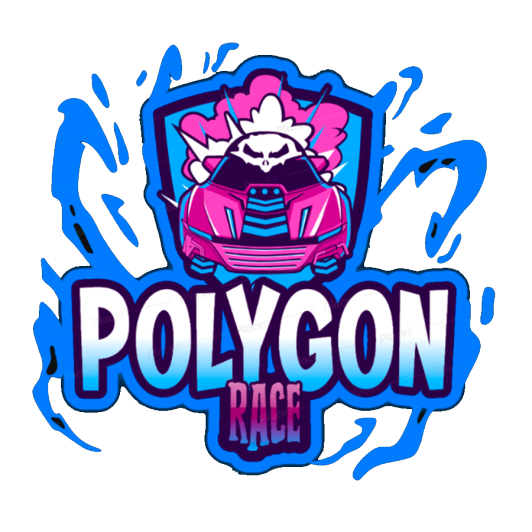
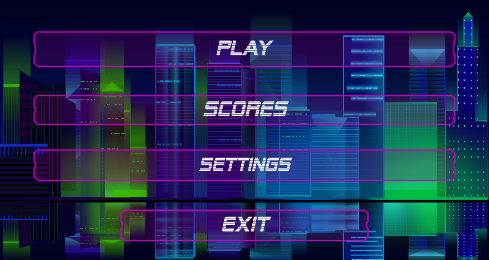

# POLYGON-RACE

  

## Introduction
Polygon Race is a simple-to-play 3D racing video game developed in the Unity video game engine integrating other tools such as Blender and Adobe Illustrator , with a programming logic developed in the C# language. This game has a retro-futuristic aesthetic, in which the player is immersed in a busy highway that leads to the utopian city of Polygon City, whose objective is to move at high speed avoiding traffic, generating the highest possible score and thus becoming the best Polygon Racer. 

- Landing Page: **[Poligon Race's landing page](http://54.175.222.196)**

## The Team

### Santiago Peña Mosquera  
Game Logic Developer  
**[LinkedIn](https://www.linkedin.com/in/santiago-pe%C3%B1a-mosquera-abaa20196/)**

### Alejandro Rusca Moreno  
Front-end Developer  
**[LinkedIn](https://www.linkedin.com/in/alejandro-rusca-moreno-59138b1a1/)**

### Ricky Fabian Mosquera  
Front-end Developer  
**[LinkedIn](https://www.linkedin.com/in/fabian-mosquera-631a5a1a1/)**

### Juan José Gómez Rodríguez  
Tester and Artist  
**[LinkedIn](https://www.linkedin.com/in/juan-jos%C3%A9-g%C3%B3mez-1b8b801a0/)**

### Andres Felipe Rodriguez Cardona  
Game designer  
**[LinkedIn](https://www.linkedin.com/in/andres-rodriguez-851034167/)**

## Installation

There are two ways to get polygon race
  1. The fast way:
    1. Go to our landing page **[Poligon Race's landing page](http://54.175.222.196)** and download one of our 2 versions for window or macos, depending on your operating system, unzip the directory, and click on the **Polygon Race** executable
  2. The long way:
    1. Download untity from its official site [https://unity3d.com/es/get-unity/download](https://unity3d.com/es/get-unity/download)  
    2. Clone this repository `git clone https://github.com/santiagopemo/polygon-race`  
    3. When you have opened the project in Unity go to **file -> Build Settings -> Build**  
    4. Execute **Polygon Race** executable file  
  
## Usage
The game starts at the interface of the main menu, where you can choose one of four options, **play**, view the **scores**, change the **settings** and **exit**  

  

  

To play, only 3 keys are needed, the **right arrow** to move to the right, the **left arrow** to move to the left, and the **p** key to pause the game  

  

  

In **settings** you can change the **volume** of the background music, enable or disable the sound **effects** and change your **alias**  

  

 
## Technologies

### Blender
Blender is a free and open-source 3D computer graphics software toolset used for creating animated films, visual effects, art, 3D printed models, motion graphics, interactive 3D applications, virtual reality, and computer games.

### Unity
Unity is a cross-platform game engine. The engine can be used to create three-dimensional, two-dimensional, virtual reality, and augmented reality games, as well as simulations and other experiences. The engine has been adopted by industries outside video gaming, such as film, automotive, architecture, engineering, and construction.

### C#
C# is a general-purpose, multi-paradigm programming language encompassing strong typing, lexically scoped, imperative, declarative, functional, generic, object-oriented, and component-oriented programming disciplines.

## The Challenge
During the last years, the video game industry has experienced high growth rates, due to the development of computing, processing capacity, and audiovisual capacity. In terms of volume, there are around 383,000 games on Google Play, which means 15.34% of the applications on this platform, and they are the applications that are downloaded the most. During 2018, 38.68% of the estimated 29.4 billion downloads were games. 

According to the market intelligence company Newzoo, the video game industry closed 2019 with global revenues of more than 150,000 million dollars and year-on-year growth of 9.6%, dominating audiovisual entertainment, well ahead of music and cinema.
These data reveal a great need for people to occupy their leisure time through these types of applications. That is why this project proposes the development of a racing video game, with simple playability.

## Where to download?
you can download Polygo Race from Sapopetas Studio website

## Screenshots!

%205.56.46%20p.%C2%A0m..png)

%205.28.58%20p.%C2%A0m..png)

%205.28.12%20p.%C2%A0m..png)

%205.27.45%20p.%C2%A0m..png)

%205.25.34%20p.%C2%A0m..png)

%205.27.56%20p.%C2%A0m..png)
